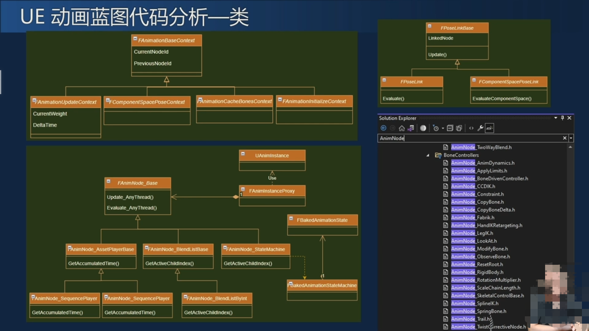
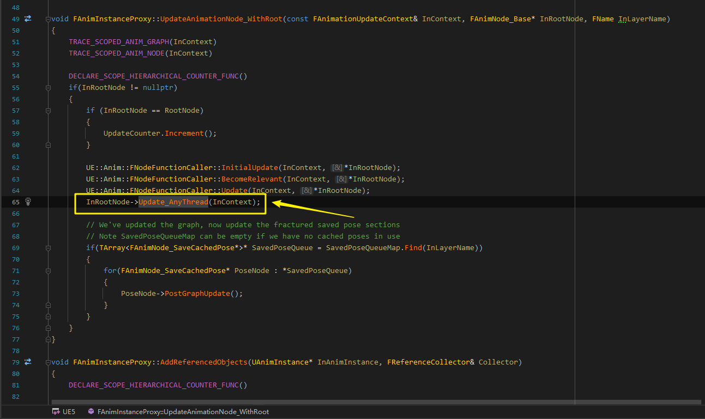
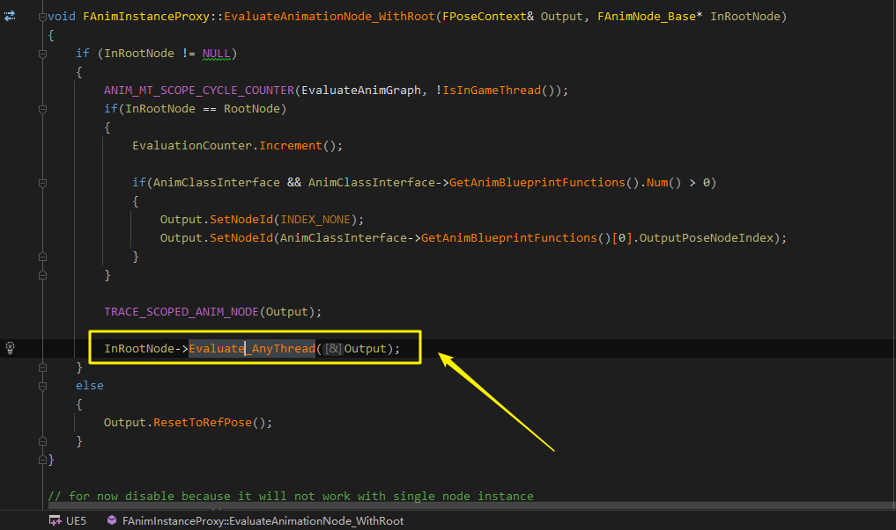

# UE AnimSystem Overview
> From NTES xufei
## UE动画管线概述(3D Skeletal Animtion)
- 美术做好的**Mesh和Skeleton** 导入引擎
- 动画做好的**AnimSequence** 导入引擎 
- **Anim Blueprint**组织使用动画片段
- Runtime运行**动画蓝图更新**角色动画
## Anim Background Knowledge
- UE蒙皮
  - GPU : GpuSkinVertexFactory.ush
  - CPU : SkeletalRenderCPUSkin.cpp
- Rigging&Skinning
  - Rigging(绑定): 创建关节以及关节之间的约束，即**创建骨骼体**
  - Skinning(蒙皮) : 分配关节点和权重给Mesh顶点，即**确定影响顶点运动的关节及权重**
- 为什么要做动画蓝图？
  - 动画资源有限，但是需要适应的情景很多，所以需要一个节点来组织(融合叠加切换和复用)动画，这个节点在UE中称为动画蓝图
- UE动画蓝图
  - AnimGraph(动画切换) & EventGraph(事件、控制流和数据)
  - 节点丰富
    - Additive : 叠加
    - Blend : 融合
      - Layer Node : Layereblendperbone.. 不同部位动画不同(通过Mask来实现)
      - blend poses : 动画之间的融合
    - State Machine : 多动画状态切换
    - Montage : 支持事件触发，MT支持同步
## AnimGraph Analysis
- EventGraph更新条件，AnimGraph输出Pose
- 动画Pose作为数据流
- Linked AnimGraph : 动画蓝图的复用，模块化
- Pose Cache : 动画状态 LinkedGraph都有一个输出，在其他动画模块中可以访问到，类似动画的全局变量(我理解)
- 动画更新步骤
  - Update Variables : 角色速度朝向
  - Update : 逐个更新节点(深度优先遍历，blend权重...)
  - Evaluate : 逐个更新节点(深度优先遍历，计算当前姿态，收集事件)
  - Trigger Event : 触发事件
- Code Analysis 
  - 类图
  
  - Update入口
  
  - Evaluate入口
  
## AnimBP Expand
- Runtime Node & Editor Node
- 新增动画节点的准备工作: 实现一个FAnimNode_XXX:FAnimNode_Base，再实现一个蓝图中用的UAnimGraphNode_XXX:UAnimGraphNode_BAse
- 简单实例: 
  - FAnimNode_SpringBone : Editor动画图节点
  - UAnimGraphNode_SpringBone : 运行时的动画节点(包含真正的Node功能实现)
  
## AnimBP 设计思想
- 策划美术友好，图形化直观，偏好开发效率
- 将动画作为特殊数据流处理，把Pose作为输出