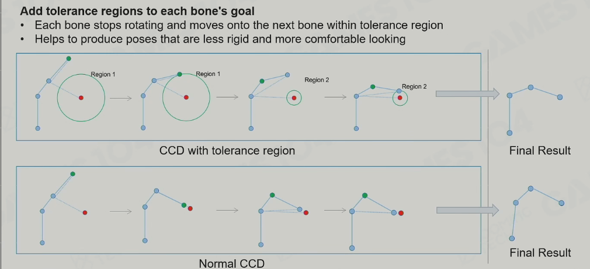
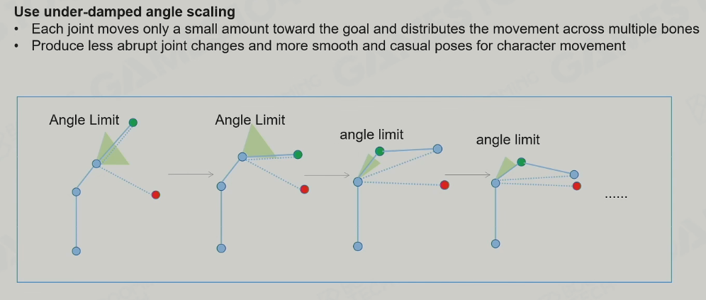
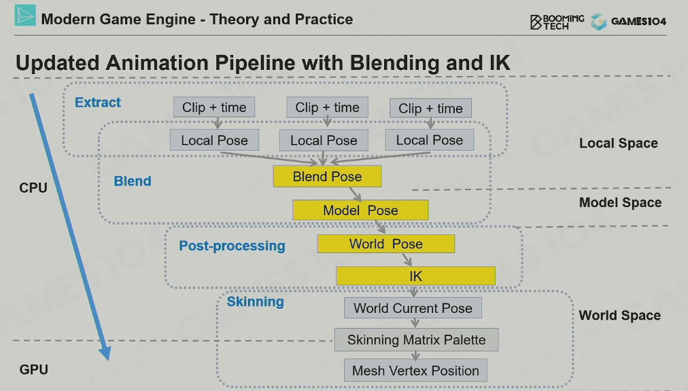

# GAMES104 - Anim System
### 主要挑战
- 性能
- 真实
## Basics of Animation Technology
### 2D Animation
- Sprite Anim 精灵动画：播放一串连续的图片
- Live2D：变换图片上的一系列控制点来做表情和动作的变化；Key Frame
### 3D Animation
- Vertex Anim:逐顶点动画(存的是每帧顶点数据)
    - 很灵活
    - 大部分使用vertex animation texture(VAT)实现，通常需要两张，Translation Texture & Rotation Texture
    - **适用于复杂变形动画**
    - 需要大量的数据，数据爆炸
- Morph Target animation:目标变形动画(一种顶点动画的变体)
    - 在关键帧动画序列之间插值得到平滑的动画(Key Pose -> Play with Lerp)
    - **适用于面部动画**
- 3D Skinned Animation(骨骼蒙皮动画， 存多帧关节数据，和顶点相对于关节的位置数据)
    - Mesh/Skin被绑定到骨骼的关节(多个)
    - 每个顶点受不同关节影响有不同权重(多个关节的Trans加权后得到顶点的Trans)
    - **比逐顶点动画数据量小，Mesh的动画可以更自然**(就像人的皮肤一样)
    - 现代游戏引擎中最常见的技术
- 2D Skinned animation
    - 衍生自3D蒙皮动画类似的2D版本
- Physics-based Animation
    - Ragdoll
    - 物理模拟：布料和流体模拟
    - IK反向动力学
- ACC(Animation Content Creation)
    - Key Frame:手K动画
    - Motion Capture:动捕
### Skinned Animation Impl
- How to Animate a Mesh?
    - Mesh: 给绑定Pose创建一个Mesh网格
    - Skeleton: 给网格创建一个绑定的骨架
    - Skinning/Rig: 将Mesh上每个顶点关联/绑定到相关的骨骼上
    - Pose: 调整骨骼体到想要的Pose
    - Animation: 根据骨骼的Trans变化以及权重更新网格体顶点的位置
- Different Spaces
    - WS: World Space
    - MS: Model Space(模型坐标系，类似Root)
    - LS: Local Space(骨骼的局部坐标系)
- Joint vs. Bone
    - Joint: 关节(真正用来控制Pose的对象)
    - Bone: 骨骼(两个关节之间的才是骨头，没什么实际作用)
- Humaniod Skeleton in Real Game
    - Normal : 50-100 joins(标准骨骼)
    - Others : facial joins, weapon join, mount joint or gameplay joints(披风 面部 以及 Gameplay需要的Joints, 比如武器和骑乘的关节点)
- Root Joint(Skeleton's Start)
    - Root joint: 脚之间，贴地
    - Pelvis joint: 骨盆的位置
- Bind Pose - T-pose vs. A-pose
    - 行业实践，A-pose肩膀处更自然，更适用
    - Skeleton Pose: 从绑定姿势变换关节/骨骼点位置来的Pose
- Math of 3D Rotation 
    - Euler Angle的问题
        - 难以插值
        - 旋转叠加需要旋转矩阵，难以叠加
        - 绕XYZ轴旋转简单，绕其他的轴旋转很难
    - Quaternion
        - 游戏数学的基础
- Joint Pose
    - Rotation Translate Scale
    - 动画数据存在local space:如果存在model/world插值起来不方便
    - Skinning Matrix(**不太懂**):思路是mesh顶点相对于绑定骨骼的Transform不变
- Clip: 一个Pose序列
- Interpolation
    - LERP
    - NLERP:使用Quaternion插值
    - SLERP(**不太懂**)
- Simple Anim Runtime Pipeline
    - 输入Clip和time, 从上一帧Pose到目标帧Pose之间插值(LS)得到当前帧的骨架Pose,换算到MS，算出蒙皮矩阵(WS), 最终计算出顶点的位置

### Animation Compression(动画压缩)
- Scale：忽略掉Scale Track
- Keyframe(误差比较大，如果要好的效果，需要加很多关键帧):只存关键帧，然后在之间插值。去关键帧的思路：遍历每帧动画，然后Lerp(Frame[i-1], Frame[i+1])之间插值，如果误差太大，那么就把中间帧当作关键帧存起来
- Catmull-Rom Spline: 效果很好
- float Quantization: 数据压缩(**不太懂**)
### Animation DCC(Pileline)
- Mesh building: LowpolyMesh
- Skeleton Binding
- Skinnning - Auto Calculation, hand adjust
- Animation Creation : artist make keyframe and program handle

### Q&A
- Mesh顶点绑定的关节有数量限制嘛？
    - 理论上可以绑定无数个，但是绑太多会大大增加计算量，一般不超过4个
## Advanced Animation Technology
### Animation Blend
- Case : Walk to Run 
- Math of Blending : LERP
- Calcute Blend Weight : 简单例子，走到跑，用速度算不同动画Clip的权重，Wi累加值为1
- Align Blend Timeline : 时间线对齐是动画可以blend的基础
- Blend Space
  - 1D BS : directional Movement 单向，单参数
  - 2D BS : 双向，双参数
    - 延申：Delaunay三角化(**不懂**)
- Skeleton Masked Blending 
  - Case : 不同的部分的关节播不同的动画
- Additive Blending
  - 只存变化量，然后作为增量叠加到其他的动画Clip上
- Cross Fades
  - Smooth transition : 按照Timeline正常混合多Clips
  - Frozen transition : 将某些Clip的Pose停住来混合其他Clip
- Animation State Machine(ASC)
    - Core Item : State Nodes(动画状态) and Transitions(过渡条件)
    - Layered ASM : 角色身体的不同部分播不同动画，动画分层
- Animation Blend Tree
  - Blend Tree
    - LERP Blend Node : Clips -> LERP NODE -> Output Pose
    - Additive Blend Node
### Inverse Kinematics
- Basic Concepts
  - End-effector : 关节的期望位置
  - IK : Inverse Kinematics
  - FK : Forward Kinematics
- Two Bones IK : 最简单的IK
- 更完备：长链IK, 解剖学
- 经典算法
  - Heuristic Algorithm
    - CCD(Cyclic Coordinate Decent)循环坐标下降 : 从末端的关节开始，旋转关节，向期望点靠近，迭代多次得到结果
    - Optmized CCD 1 : 传统的CCD，先迭代的关节通常旋转幅度很大，效果不好，对旋转的幅度做限制，不要完全转到朝向目标方向
    
    -  Optmized CCD 2(给关节旋转加上阻力，越来越小) : 对于关节旋转的角度限制越靠近根骨骼越小
    
    - FABRIK(Forward And Backward Reaching IK)
      - 一次正向一次反向循环迭代
      - 正向：强行把较末端关节拉到期望位置，然后再根据原始偏移调整关节链上的其他关节，直到root
      - 反向：把root拉到原来位置，然后根据原始trans偏移把链上的较末端关节调整到位
      - 也可以处理骨骼约束
- Multiple End-Effectors : 多控制点，有不同骨骼的期望点
  - Jacobian Matrix : 梯度下降
- Other IK Solutions
  - Physics-based Method(基于物理)
    - 更自然，如果没有优化的话需要大量计算
  - PBD(Position Based Dynamics)
    - 减少了计算量
  - Fullbody IK in UE5(**可以研究一下**)
### Animation Pipeline
- Updated Animation Pipeline with Blending and IK

### Animation Graph
### Facial Animation 
- Morph Targe Animation(数据量大)
- UV texture Facial Animation : 在简单的头部形状上使用一系列的texture maps来达到动画效果
### Retargeting 
- 目的: 在角色间共享动画
- Details
  - Lock Feet by IK after Retargeting
- Retargeting with Different Skeleton Hierarchy
  - Easy Solution in **Omniverse** : 做骨骼映射
- Morph Animation Retargeting : different face sharing the same anim
### Summary
- 通过Gameplay来控制**Blending system**是驱动角色的关键
- **IK**帮助角色适应**环境约束**
- **Morph target animation**在**人脸动画**中应用的很好
- **Retargeting help reuse skeleton animation and facial animations among characters**
